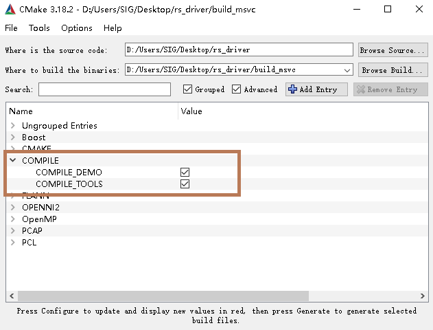

# **rs_driver** 

[TOC]

## 1 工程简介

  **rs_driver**为速腾聚创雷达驱动内核。支持**RS-LiDAR-16**, **RS-LiDAR-32**, **RS-Bpearl**, **RS-128**和**RS-80**的点云数据解析，方便用户二次开发使用。

## 2 编译与安装

rs_driver目前支持下列系统和编译器：
- Windows
  - MSVC 
  - Mingw-w64

- Ubuntu
  - gcc 

### 2.1 依赖库的安装

rs_driver 依赖下列的第三方库，在编译之前需要先安装的它们：
- Boost
- pcap
- PCL (非必须，如果不需要可视化工具可忽略)

#### 2.1.1 Ubuntu中的依赖库安装
```shell
sudo apt-get install libboost-dev libpcap-dev libpcl-dev
```

#### 2.1.2 Windows下的依赖库安装

##### Boost

Windows下需要从源码编译Boost库，请参考[官方链接](https://www.boost.org/doc/libs/1_67_0/more/getting_started/windows.html)。编译安装完成之后，将Boost的路径添加到系统环境变量```BOOST_ROOT```。

如果使用MSVC，也可以选择直接下载相应版本的预编译的[安装包](https://boost.teeks99.com/)。

##### pcap

下载[developer's pack](https://www.winpcap.org/install/bin/WpdPack_4_1_2.zip)到任意位置，然后将```PATH_TO_WpdPack_4_1_2/WpdPack``` 添加到环境变量```PATH```

##### PCL

*注：如果不编译可视化工具，可不编译安装PCL库*

(1) MSVC

如果使用MSVC编译器，可使用PCL官方提供的[All-in-One Installer](https://github.com/PointCloudLibrary/pcl/releases)安装。

安装过程中选择 “Add PCL to the system PATH for xxx”:


(2) Mingw-w64

PCL官方并没有提供mingw编译的库，所以需要按照[官方说明](https://pointclouds.org/documentation/tutorials/compiling_pcl_windows.html), 从源码编译PCL并安装。


### 3 使用方式

#### 3.1 安装使用

*注：在Windows中，**rs_driver** 暂不支持安装使用。请按照3.2的说明，将 **rs_driver**作为工程的子模块使用。*

首先安装驱动

```sh
cd rs_driver
mkdir build && cd build
cmake .. && make -j4
sudo make install
```

使用时，需要在CMakeLists文件中链接雷达驱动

```cmake
find_package(rs_driver REQUIRED)
include_directories(${rs_driver_INCLUDE_DIRS})
target_link_libraries(project ${rs_driver_LIBRARIES})
```

#### 3.2 作为子模块使用

直接将**rs_driver**放入用户工程内，在CMakeLists中链接即可

```cmake
list(APPEND CMAKE_MODULE_PATH ${PROJECT_SOURCE_DIR}/rs_driver/cmake)
include(rs_driver)
include_directories(${rs_driver_INCLUDE_DIRS})
target_link_libraries(project ${rs_driver_LIBRARIES})
```


### 4 示例程序

rs_driver提供了两个示例程序，存放于*rs_driver/demo*中：

- demo_online.cpp
- demo_pcap.cpp

若希望编译这两个示例程序，执行CMake配置时加上参数：

```cmake
cmake -DCOMPILE_DEMOS=ON -DCOMPILE_TOOLS=ON ..
```

或者在cmake-gui中勾选```COMPILE_DEMO```和```COMPILE_TOOLS```两个选项：



用户可参考示例程序，编写自己的代码调用雷达驱动。


### 5 快速上手

[在线连接雷达](doc/howto/how_to_online_use_driver.md)

[离线解析pcap包](doc/howto/how_to_offline_decode_pcap.md)


### 6 其他资料

[参数简介](doc/intro/parameter_intro.md)

[消息简介](doc/intro/message_intro.md)

[异常简介](doc/intro/errcode_intro.md)

[接口简介](doc/intro/api_intro.md)


---


### 1 Introduction

**rs_driver** is a driver kernel for RoboSense LiDAR. It supports **RS-LiDAR-16**, **RS-LiDAR-32**, **RS-Bpearl** ,  **RS-128** and **RS-80** models . With the help of CMake, it can be easily incorporated into your own project to parse point cloud data from RoboSense LiDAR device.

### 2 Compilation and Installation

**rs_driver** is compatible with the following platforms and compilers: 

- Windows
  - MSVC ( tested with VC2017 and VC2019)
  - Mingw-w64 (tested with x86_64-8.1.0-posix-seh-rt_v6-rev0 )
- Ubuntu (16.04, 18.04)
  - gcc (4.8+)

### 2.1 Install dependancies

**rs_driver** depends on the following third-party libraries. They must be compiled/installed properly in advance:

- Boost 

- pcap

- PCL (optional, only needed when building visualization tool)

#### 2.1.1 Install dependancies in Ubuntu

```sh
sudo apt-get install libboost-dev libpcap-dev libpcl-dev
```

#### 2.1.2 Install dependancies in Windows

##### Boost

In Windows, Boost needs compiling from source, please refer to the [official guide](https://www.boost.org/doc/libs/1_67_0/more/getting_started/windows.html) for detailed instructions. 

Once finishing installing Boost, add a system environment variable named  ```BOOST_ROOT```  which is set to your Boost path. 

If using MSVC as your compiler, these pre-built [binary installers](https://boost.teeks99.com/) may save you some time.   


##### PCAP

Download pcap's [developer's pack](https://www.winpcap.org/install/bin/WpdPack_4_1_2.zip) to your favorite location and add the path to ```WpdPack_4_1_2``` folder to the ```Path``` environment variable. 


##### PCL

*Note: you can skip installing PCL if you don't want to compile visualization tool.* 

(1) MSVC

Please use one of the provided [all-in-one installers](https://github.com/PointCloudLibrary/pcl/releases), which already contains prebuilt PCL binaries and are ready to be used without any compilation step.


Select the "Add PCL to the system PATH for xxx" option during installation.


(2) Mingw-w64

Since there'are no installers for mingw-w64 compiler available, PCL needs to be compiled out from source as instructed in this [tutorial](https://pointclouds.org/documentation/tutorials/compiling_pcl_windows.html). 


### 3 Usage

There are two ways to use **rs_driver** in your own CMake project. 

#### 3.1 Install in advance

*Note: installation is not supported in Windows.* 

(1) Install the driver

```sh
cd rs_driver
mkdir build && cd build
cmake .. && make -j4
sudo make install
```

(2) Then find  rs_driver package and link to it in your CMakeLists.txt

```cmake
find_package(rs_driver REQUIRED)
include_directories(${rs_driver_INCLUDE_DIRS})
target_link_libraries(project ${rs_driver_LIBRARIES})
```

#### 3.2 Use rs_driver as a module

Append  to the CMAKE_MODULE_PATH variable the path to rs_driver.cmake file. 

and include rs_driver module in your CMake project.  

```cmake
list(APPEND CMAKE_MODULE_PATH ${PROJECT_SOURCE_DIR}/rs_driver/cmake)
include(rs_driver)
include_directories(${rs_driver_INCLUDE_DIRS})
target_link_libraries(project ${rs_driver_LIBRARIES})
```


### 4 Demo Code

rs_driver supply two demo programs which are stored in*rs_driver/demo*：

- demo_online.cpp
- demo_pcap.cpp


Demo will not be compiled by default. To build demo programs, set the following options to ```ON``` when configuring using cmake:

```cmake
cmake -DCOMPILE_DEMO=ON -DCOMPILE_TOOS=ON ..
```

Or check the ```COMPILE_DEMO``` and ```COMPILE_TOOLS` checkbox in cmake-gui:


User can refer to the demo code for usage of rs_driver api. 


### 5 Quick Start

[Online connect LiDAR](doc/howto/how_to_online_use_driver.md)

[Offline decode pcap bag](doc/howto/how_to_offline_decode_pcap.md)


### 6 Others

[Intro to parameters](doc/intro/parameter_intro.md)

[Intro to message types](doc/intro/message_intro.md)

[Intro to error codes](doc/intro/errcode_intro.md)

[Intro to api](doc/intro/api_intro.md)


