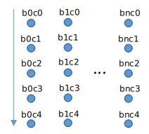
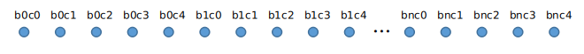

# 如何连接在线雷达

## 1 简介

本文档描述如何连接在线雷达，得到点云数据。

## 2 设计考虑

rs_driver有如下设计目标：
+ 让点云的创建与点云的使用并行
+ 避免点云的复制
+ 避免点云的反复分配和释放

如下描述的步骤，是希望的rs_driver与调用者交互的方式。


rs_driver运行在自己的线程`construct_thread`中。它
+ 从调用者得到空闲的点云实例。调用者从一个空闲的点云队列`free_point_cloud_queue`得到这个实例。如果队列为空，则创建一个新的。
+ 解析MSOP/DIFOP包，构建（填充）点云实例
+ 将填充好的点云实例返还给调用者
+ 调用者将这个实例转移到另一个点云队列`stuffed_point_cloud_queue`，等待处理。

调用者的点云处理代码，运行在自己的线程`process_thread`中。它
+ 从待处理点云队列`stuffed_point_cloud_queue`，取出一个点云实例。
+ 处理这个点云实例
+ 处理后，将它放回空闲队列`free_point_cloud_queue`，等待rs_driver再次使用。

## 3 步骤

如下是使用rs_driver的步骤。

### 3.1 定义点

点是点云的基本组成单元。rs_driver支持点的如下成员。
- x -- 坐标X，类型float
- y -- 坐标Y，类型float
- z -- 坐标Y，类型float
- intensity -- 反射率，类型uint8_t
- timestamp -- 时间戳，类型double
- ring -- 通道编号。对于RS80, 通道编号的范围是 0~79 (从下往上)。

如下是几个例子。

- 点的成员包括 **x, y, z, intensity**

  ```c++
  struct PointXYZI
  {
    float x;
    float y;
    float z;
    uint8_t intensity;
    ...
  };
  ```

- 如果使用PCL库，也可以简单使用PCL的点定义 **pcl::PointXYZI**。

- 点的成员包括 **x, y, z, intensity, timestamp, ring**

  ```c++
  struct PointXYZIRT
  {
    float x;
    float y;
    float z;
    uint8_t intensity;
    double timestamp;
    uint16_t ring;
    ...
  };
  ```

使用者可以向点的定义中加入新成员、删除成员、改变成员的顺序，但是不可以改变点的类型。

### 3.2 定义点云类型

如下是点云的定义。

  ```c++
  template <typename T_Point>
  class PointCloudT
  {
  public:
    typedef T_Point PointT;
    typedef std::vector<PointT> VectorT;

    uint32_t height = 0;    ///< Height of point cloud
    uint32_t width = 0;     ///< Width of point cloud
    bool is_dense = false;  ///< If is_dense is true, the point cloud does not contain NAN points
    double timestamp = 0.0; ///< Timestamp of point cloud
    uint32_t seq = 0;       ///< Sequence number of message

    VectorT points;
  };
  
  typedef PointXYZI PointT;
  typedef PointCloudT<PointT> PointCloudMsg;
  ```

使用者可以向这个定义增加新成员，改变成员顺序，但是不可以改变成员类型，或者删除成员。

### 3.3 点在点云中的排列

对于机械式雷达，说明点在点云中是如何排列的，可能是有意义的。

为了描述方便，假设有一个5通道的机械式雷达。雷达一个block接一个block地扫描。竖直方向的一轮扫描对应一个block，5个通道各一个点。（雷达每轮扫描的通道次序是不变的，但一般不是严格从上往下。下面的图中是从上往下，只是为了描述简单。）

如下图，它扫描b0c0(block 0 channel/laser 0), b0c1, b0c2, b0c3, b0c4, 然后扫描b1c0, b1c1, b1c2, b1c3, b1c4, 如此下去。


相应地，rs_driver将对应的点保存在点云的成员points中，这是一个vector。如下图。



### 3.4 定义LidarDriver对象

LidarDriver类是rs_driver的接口类。

这里定义一个LidarDriver的实例。

```c++
int main()
{
  LidarDriver<PointCloudMsg> driver;          ///< Declare the driver object
  ...
}
```

### 3.5 配置LidarDriver的参数

RSDriverParam定义LidarDriver的参数。

这里定义RSDriverParam变量，并配置它。

+ `InputType::ONLINE_LIDAR`意味着从在线雷达得到MSOP/DIFOP包。
+ `LidarType::RS16`是雷达类型
+ 分别设置接收MSOP/DIFO包的端口号。如果不知道端口是多少，可以用第三方工具（如WireShark）先查看一下。

```c++
int main()
{
  ...
  RSDriverParam param;                             ///< Create a parameter object
  param.input_type = InputType::ONLINE_LIDAR;      /// get packet from online lidar
  param.input_param.msop_port = 6699;             ///< Set the lidar msop port number, the default is 6699
  param.input_param.difop_port = 7788;            ///< Set the lidar difop port number, the default is 7788
  param.lidar_type = LidarType::RS16;             ///< Set the lidar type. Make sure this type is correct
  ...
}
```

### 3.6 定义和注册点云回调函数

+ 如前面章节所说，使用者需要向rs_driver提供空闲点云。这里定义第一个点云回调函数。

```c++
SyncQueue<std::shared_ptr<PointCloudMsg>> free_cloud_queue;

std::shared_ptr<PointCloudMsg> driverGetPointCloudFromCallerCallback(void)
{
  std::shared_ptr<PointCloudMsg> msg = free_cloud_queue.pop();
  if (msg.get() != NULL)
  {
    return msg;
  }

  return std::make_shared<PointCloudMsg>();
}
```

+ 使用者从rs_driver得到填充好的点云。这里定义第二个点云回调函数。

```c++
SyncQueue<std::shared_ptr<PointCloudMsg>> stuffed_cloud_queue;

void driverReturnPointCloudToCallerCallback(std::shared_ptr<PointCloudMsg> msg)
{
  stuffed_cloud_queue.push(msg);

  RS_MSG << "msg: " << msg->seq << " point cloud size: " << msg->points.size() << RS_REND;
}
```

提醒一下，这两个回调函数都运行在rs_driver的点云构建线程中，所以它们不可以做太耗时的任务，否则会导致MSOP/DIFOP包不能及时处理。

+ 使用者在自己的线程中，处理点云。

```c++
void processCloud(void)
{
  while (1)
  {
    std::shared_ptr<PointCloudMsg> msg = stuffed_cloud_queue.popWait();
    if (msg.get() == NULL)
    {
      continue;
    }

    // Well, it is time to process the point cloud msg, even it is time-consuming.
    RS_MSG << "msg: " << msg->seq << " point cloud size: " << msg->points.size() << RS_REND;

    free_cloud_queue.push(msg);
  }
}

```

+ 在主函数中，注册两个点云回调函数。

```c++
int main()
{
  ...
  driver.regPointCloudCallback(driverReturnPointCloudToCallerCallback, 
                               driverReturnPointCloudToCallerCallback);
  ...
}
```

### 3.7 定义和注册异常回调函数

+ rs_driver检测到异常发生时，通过回调函数通知调用者。这里定义异常回调函数。

```c++
void exceptionCallback(const Error &code)
{
  RS_WARNING << "Error code : " << code.toString() << RS_REND;
}
```

再一次提醒，这个回调函数运行在rs_driver的线程中，所以不可以做太多耗时的任务，否则可能会导致MSOP/DIFOP包不能及时接收和处理。

+ 在主函数中，注册异常回调函数。

```c++
int main()
{
  ...
  driver.regExceptionCallback(exceptionCallback);  ///<Register the exception callback function
  ...
}
```

### 3.8 初始化LidarDriver对象

按照RSDriverParam指定的配置，初始化LidarDriver对象。

```c++
int main()
{
  ...
  if (!driver.init(param))  ///< Call the init function with the parameter
  {
    RS_ERROR << "Driver Initialize Error..." << RS_REND;
    return -1;
  }
  ...
}
```

### 3.9 启动LidarDriver

启动LidarDriver对象。

```c++
int main()
{
  ...
  driver.start();  ///< Call the start function. The driver thread will start
  ...
}
```

## 4 祝贺

您已经完成在线雷达的驱动使用教程！

完整的代码在工程文件```rs_driver/demo/demo_online.cpp```中。

如果你还有任何疑问，请联系我们。

